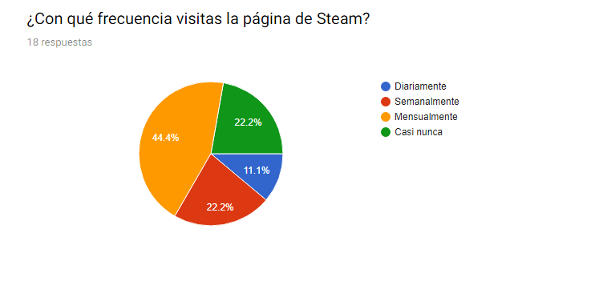
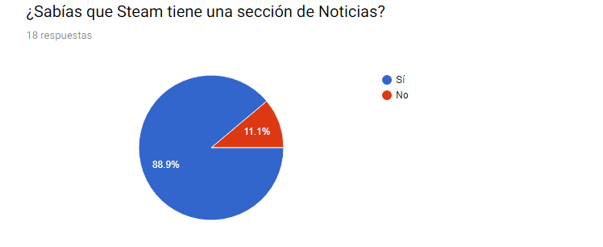
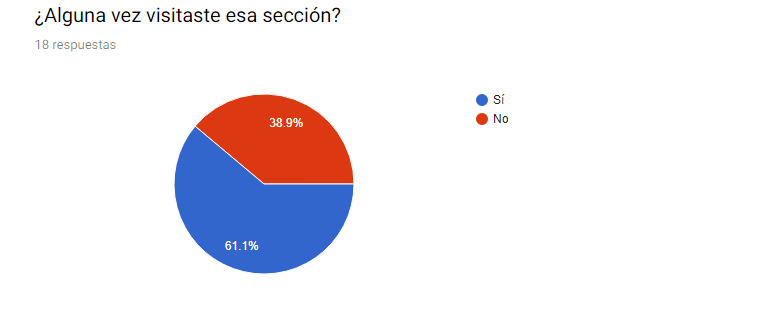
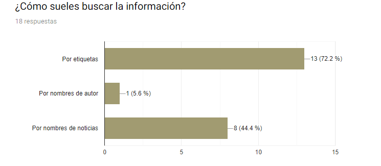
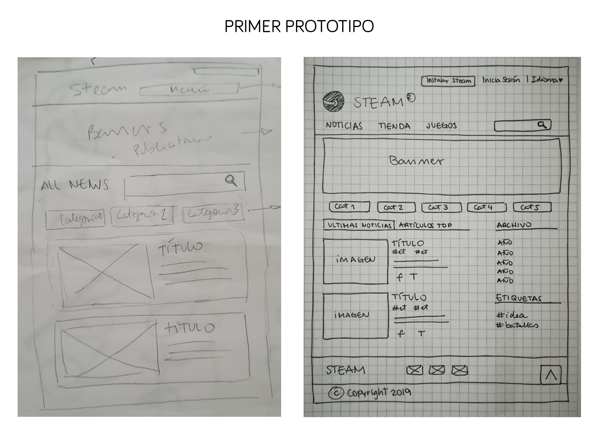
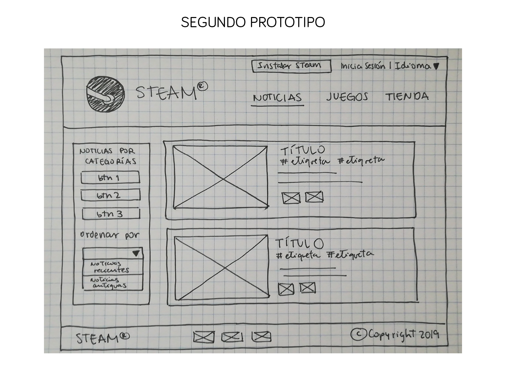

# DATA STEAM

## ÍNDICE

* [Acerca de](#ACERCA-DE)
* [Resumen del proyeto](#RESUMEN-DEL-PROYETO)
* [Proceso de diseño](#PROCESO-DE-DISEÑO)
* [Descubrimiento e investigación](#Descubrimiento-e-investigación)
* [Síntesis e Ideación](#Síntesis-e-Ideación)
* [Prototipado y User testing](#Prototipado-y-User-testing)

***

# ACERCA DE

Steam es una plataforma de distribución digital, gestión digital de derechos, comunicaciones y servicios multijugador desarrollada por Valve Corporation. Es utilizada tanto por pequeños desarrolladores independientes como grandes corporaciones de software para la distribución de videojuegos y material multimedia relacionado. Además ofrece varias canales para la comunicación entre los miembros de la comunidad, un blog con noticias sobre actualizaciones, sobre la comunidad, la posibilidad de utilizar chat de voz en cualquier momento y actualizaciones automáticas para todos los juegos que ofrece, entre otros.

***

# RESUMEN DEL PROYETO

En este proyecto **construirás una página web para visualizar un conjunto (set) de datos** que se adecúe a lo que descubras que tu usuario necesite.

Como entregable final tendrás una página web que permita **visualizar la data, filtrarla, ordenarla y hacer algún cálculo agregado**. Con cálculo agregado nos referimos a distintos cálculos que puedes hacer con la data para mostrar
información aún más relevante para los usuarios (promedio, el valor máximo o mel ínimo, etc).

***

# PROCESO DE DISEÑO

El proceso de diseño tiene 5 fases. Estas 5 fases nos permiten crear productos centrados en el usuario que nos aseguren que estamos satisfaciendo sus necesidades. Decidimos guiarnos de este gráfico para realizar nuestra investigación, pero teniendo en cuenta las herramientas, procesos, etc. que nosotras conocemos.

# Descubrimiento e investigación

## ¿Quiénes son los principales usuarios de nuestro producto?

Nuestro público objetivo principal son personas de 20 a 30 años. Que se encuentran estudiando o trabajando. Son personas que se mantienen ocupadas y en sus ratos libres buscan distraerse jugando videojuegos o juegos en línea.

**Algunas características de nuestro público:**

* Si bien hay un rango de edades para el público objetivo principal, la página y el uso, la compra de los juegos, 
o el acceso a la información está abierta a cualquier tipo de público interesado en los videojuegos. Por lo que se pensó en una interfaz que tome en consideración todas las necesidades. 

* La interfaz de noticias debe ser amigable e intuitiva, debe tener mostrar el menú de manera clara y no mostrar información que pueda confundir al usuario. Se usaron colores de la gama de Steam y se jerarquizó la información, para hacer más ordenado todo. 

***

# Síntesis e Ideación

## Encuesta

Realizamos una pequeña encuesta con personas dentro del rango de edad del público objetivo y que además fueran asiduos a la página o juegos de Steam.
Entre las preguntas que realizamos, rescatamos estas:

* ¿Con qué frecuencia visitas la página de STEAM?

Descubrimos que al menos una vez al mes, los usuarios suelen visitar la página. Cuándo les preguntamos a qué se debía esto, la respuesta fue que para ellos era importante enterarse de las novedades, o conectarse a la comunidad. Y que visitarían la página, si tuvieran más tiempo. 

* ¿Sabías que STEAM tiene una sección de Noticias?

De los usuarios que visitan la página, un pequeño porcentaje no sabe qué existe una sección de Noticias, esto se debe a que encuentran la página desordenada, la infomación los confunde, les parece aburrida la navegación por lo que no deciden quedarse mucho tiempo. 

* ¿Alguna vez visitaste esa sección?

La siguiente pregunta, para los usuarios que sabían de la existencia de la sección noticas, fue si la visitaban. Hubo un porcentaje que respondió que no, y esto se debe, a que esa sección les sigue pareciendo aburrida, desordenada y confusa.

* ¿Cómo sueles buscar la información?

Al preguntar cómo suelen buscar la información, respondieron que se les haría fácil si fuera por categorías(etiquetas).

## Historias de usuarios

Para definir las historias de nuestros usuarios,decidimos enfocarnos en las necesidade de nuestro público objetivos, rescatar algunas de las respuestas brindadas en las encuestas y sumar comentarios que nos dejaron en esta misma encuesta.

En base a todo esto, formulamos las siguientes historias:

**1. Yo como usuario quiero ver todas las noticias al ingresar a la página**

*Definición de terminado:*
- Crear estructura HTML
- Filtrar nueva data (propiedades: title, url, contents)
- Mostrar contenido en la consola
- Crear función en data.js 
- Llamar función en main.js
- Crear un for para mostrar las noticias
- Usar template literal para ordenar la data que se muestra (cómo hacer una tabla)
- Pintar en el DOM las noticias

**2. Yo como usuario quiero buscar/filtrar las noticias por autor/categoría**

*Definición de terminado:*
- Definir categorías a filtrarse, según las propiedades de nuestra data
- Crear funciones de filtrado en data.js
- Función que engloba el filtrado en data.js
- Definir entre select o un botón
- Ocultar la data de inicio cuando se llame a la data filtrada
- Usar esas funciones desde main.js
- Crear función que use addEventListener y llame a la data por categorías
- Usar template literal para mostrar en el DOM

**3. Yo como usuario quiero ordenar las noticias por fechas para poder leer temas actuales (actual a antigua)**

*Definición de terminado:*
- Definir entre select o un botón, etc.
- Probar método new Date (timestamp)
- Crear una función que convierta las fechas 
- Implementar el método sort en unitario
- Método sort para ascendente
- Método sort para descendente
- Función que agrupe ambos
- Englobar función para llamarla en el main.js
- Crear función que use addEventListener para llamar las funciones de sort
- Pintar la data en el DOM

***
# Prototipado y User testing

En base a las historias de usuarios se creó un primer prototipo, de baja fidelidad a mano.

*Primer testeo*

La primera foto es un sketch rápido de lo que sería el primer prototipo. Cuando testeamos este prototipo, nos dimos cuenta que no era intuitivo para todos ellos. Algunos pensaban que aún estaban en la página principal, la imagen banner les parecía lo principal y no las noticias. No entendían muy bien los botones de categorías. Confundían las categorías con las etiquetas y les el menú de archivo, a muchos les parecía demás porque no solían buscar la información de esa manera.

*Segundo testeo*

En este caso, los usuarios podían identificar el menú de las noticias, era un poco menos confuso, pero aún habían detalles que afinar. Ellos podían elegir noticias por categorías y además podían elegir ordenarlas por fechas. En base a este diseño empezamos a diseñar nuestro HTML con algunas cosas básicas, teniendo en cuenta que siempre hay cosas que corregir. 

# Prototipado de Alta Fidelidad

Se utilizó Photoshop y Figma para desarrollar el prototipo, se tomaron en cuenta los colores y formas de la página principal de Steam.

